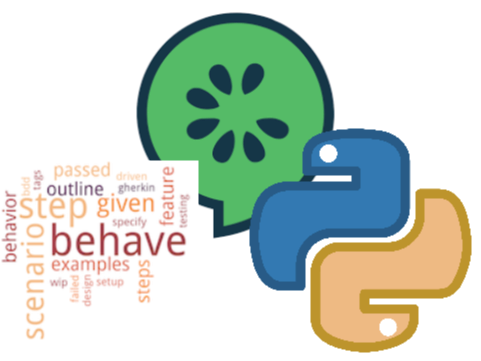

# Test cases
The purpose of this repository is to provide a tool to test the reliability and performance of the OpenStack API. It creates a real environment with routers, networks, jump hosts, virtual machines (VMs), etc., and collects statistics on API call performance and resource creation times.

## api_monitor.sh for OpenStack script (Original state)
The script currently exists as a [Bash script (api_monitor.sh)](https://github.com/SovereignCloudStack/openstack-health-monitor/blob/main/api_monitor.sh) for testing the OpenStack API's reliability and performance. The original state involves creating a real environment, collecting statistics, and handling failures. However, the script has areas for improvement, such as error handling, verbosity, and optimization.

The script follows these general steps:
1) Creates routers (VPC)
2) Creates networks and subnets
3) Sets up security groups
4) Configures virtual IPs and SSH keys
5) Creates jump host VMs and associates floating IPs with them
6) Configures jump hosts for SNAT for outbound traffic and port
7) forwarding for inbound
8) Creates internal VMs distributed across networks and AZs
9) Tests connectivity of VMs to the outside world
10) Cleans up all resources created in reverse order

### Inputs
TODO list inputs for test cases in api_monitor.sh shell script

## Gherkin test cases using behave in python (Target state)
The target state involves rewriting the test cases into Gherkin language, a structured way to describe test cases, and implementing them using Behave in Python. This transition would provide several benefits:

- **Structured Test Cases**: Gherkin language provides a structured and human-readable way to describe test scenarios, making it easier to understand and maintain the test cases.

- **Behavior-Driven Development (BDD)**: Behave allows for behavior-driven development, where tests are written based on desired behavior rather than specific implementation details. This promotes collaboration between stakeholders and developers.

- **Python Implementation**: Rewriting the tests in Python using Behave allows for better integration with existing Python codebases, improving maintainability and scalability.

In the target state, each test case described in the Bash script would be translated into a Gherkin scenario and implemented using Behave step definitions in Python. This approach would enhance the clarity, maintainability, and extensibility of the testing framework.

### Inputs
TODO list inputs for test cases in python