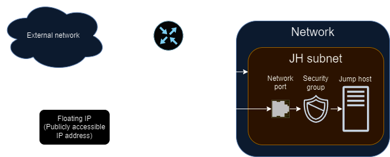

# Creating a Jump Host and Connecting to the Internet
## Overview

This documentation provides a step-by-step guide to deploying a jump host in an OpenStack environment using Terraform. A jump host serves as an intermediary between internal networks and the internet, facilitating secure access to private resources. By following these instructions, you will provision a jump host instance, configure networking components, and establish internet connectivity, enabling seamless remote access to your infrastructure.
Prerequisites



Before proceeding, ensure you have the following prerequisites:
1) **Access to an OpenStack environment:** Obtain credentials and access permissions to an OpenStack cloud platform.
2) **Terraform installed:** Install Terraform on your local machine. Refer to the Terraform documentation for installation instructions.
3) **OpenStack provider plugin:** Install the OpenStack provider plugin for Terraform. Refer to the Terraform OpenStack provider documentation for [installation details](https://github.com/terraform-provider-openstack/terraform-provider-openstack).
4) **Network configuration:** Define the external network ID and subnet CIDR block for internet connectivity.
5) **SSH key pair:** Generate an SSH key pair to access the jump host securely.

## Deployment Steps
### Configure Provider Credentials
Replace {region}, {auth_url}, {application_credential_id}, and {application_credential_secret} in provider.tf with your OpenStack region, authentication URL, application credential ID, and application credential secret, respectively.
### Configure Variables

Ensure the variables.tf file includes the necessary variables for customization, such as global_prefix, external_network_id, availability_zone, image_id, vm_size, jh_flavor, subnet_cidr, and jh_fixed_ip. Update these variables according to your environment specifications.

This is an example configuration that can be provided to terraform by adding a *.auto.tfvars*  to the terraform root directory

**Contents of .auto.tfvars**:
```
global_prefix       = "shshm-terraform-"
external_network_id = "ebfe5546-f09f-4f42-ab54-094e457d42ec"
availability_zone   = "nova"
image_id            = "36ba766d-3252-4a65-80df-b33c18b19015"
vm_size             = 12
jh_flavor           = "SCS-2V:4"
subnet_cidr         = "192.168.199.0/24"
jh_fixed_ip         = "192.168.199.12"
```
### Define Security Groups and Rules

In the security-groups.tf file, define security groups and rules to control inbound and outbound traffic to the jump host. Configure rules to allow SSH access (port 22) and any other necessary protocols.
### Create Networking Components

Define networking components in the networking.tf file, including networks, routers, subnets, ports, and floating IPs. Ensure the jump host port is associated with the appropriate security group and has a fixed IP address.
### Provision the Jump Host

Define the jump host configuration in the virtualMachine.tf file. Specify the key pair, instance flavor, availability zone, security groups, networking settings, and block device configuration.
### Execute Terraform Commands

Run the following Terraform commands in the terminal:

```bash
# Initialize terraform
terraform init

# Show planned actions
terraform plan

# Apply planned actions
terraform apply

# Destroy deployed resources
terraform destroy
```

Review the execution plan and confirm the changes to deploy the jump host.

### Access the Jump Host

Once the deployment is complete, retrieve the IP address of the jump host instance. Use SSH to connect to the jump host using the generated SSH key pair:

```bash
ssh -i <path_to_private_key> <username>@<jump_host_ip>
```

### Test Internet Connectivity

Verify that the jump host has internet connectivity by running commands such as ping, curl, or wget to external websites or services.
Conclusion

By following these steps, you have successfully deployed a jump host in your OpenStack environment and established internet connectivity. The jump host serves as a secure gateway for accessing internal resources from external networks, enhancing the overall security posture of your infrastructure.